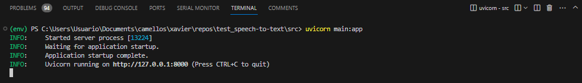
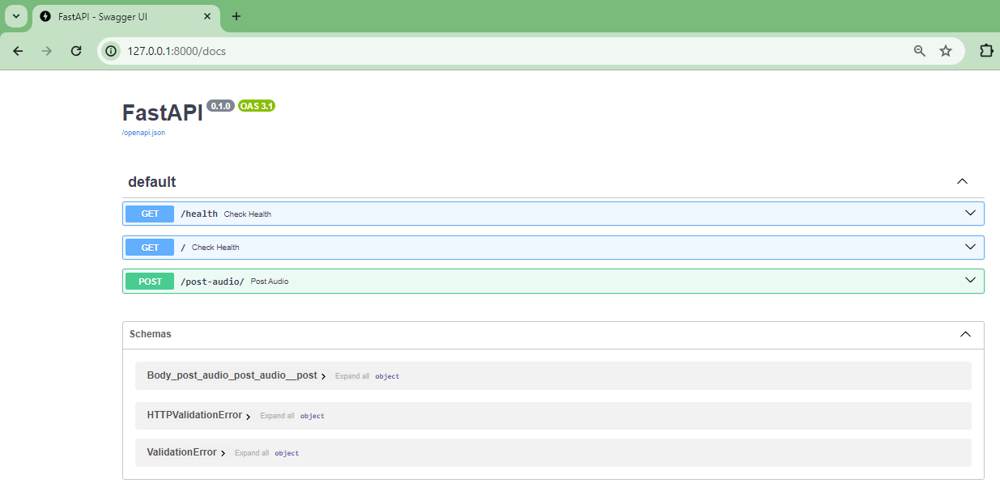
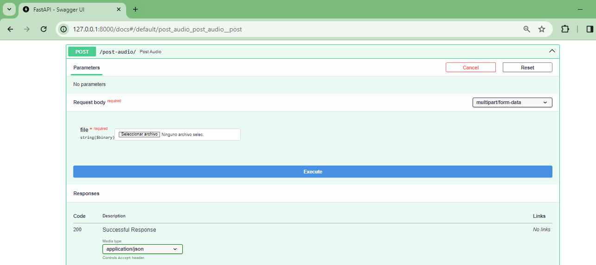
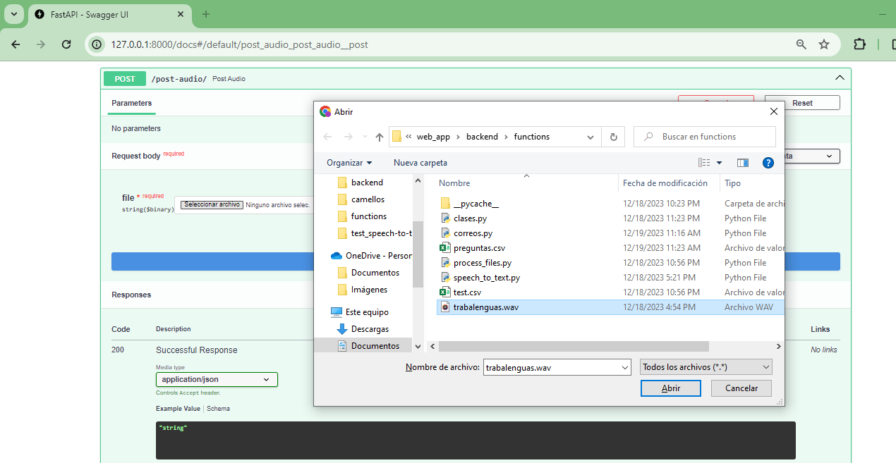
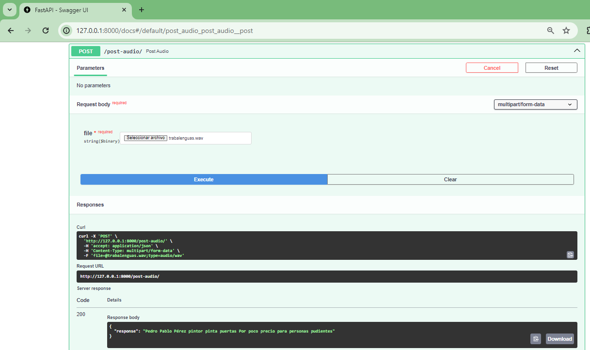

# back-test
Funciones basicas para el back end
## Requerimientos

```
pip install fastapi
pip install "uvicorn[standard]"
pip install jinja2
pip install pandas
pip install python-multipart
pip install PyAudio
pip install SpeechRecognition
```

## Entorno virtual

```
python -m venv env
.\env\Scripts\activate 
pip install -r requirements.txt
```

## Prueba

### Local

Para probar la función:

```
python speech_fuctions.py
```

### Integración en Fast API

Ya se puede invocar la función desde FastAPI, para ello, corra en la terminal el siguiente comando:

```
uvicorn main:app
```



Luego en el browser ponga la IP: ```127.0.0.1:8000/docs```



Luego suba el archivo de audio a traves del metodo **POST** y verifique que la salida es la esperada:








## Inventario de cosas
